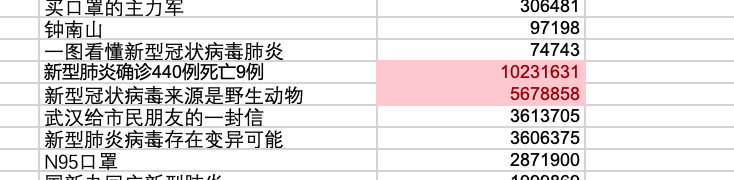

# 数据仓库与数据挖掘

参考一:挖掘社会舆论针对新冠肺炎的发展历程

- 主要依据weibo数据，并依靠其他社交媒体上的数据内容辅助分析在新冠肺炎期间，关于新冠肺炎社会舆论走向。
- 在肺炎爆发期间，大家关注的内容会随着时间的发展有所转变，请基于时间和搜索量找出几个关键的事件发展节点。(20分) 
    - 评价标准:
        - 发现关键事件的思路(5分)
        - 利用该思路的代码实现(5分)
        - 所发现的关键事件的合理性(5分) 
        - 是否结合其他数据(5分)
- 基于文本分析技术分析舆论的话题走向(30分) 
    - 评价标准:
        - 使用至少2种文本分析技术对热搜内容进行分析(每个知识点10分，依据使用的合理性进行评价)
        - 结合社会背景，阐述所发现的新冠肺炎舆论的发展过 程，以及你从这一历程中发现了什么(如对下一次社 会性事件所带来的舆论引导的启示等) (10分)

---

# 挖掘社会舆论针对新冠肺炎的发展历程

# 前期准备

### Step 1 比较抖音,头条,和微博三个社交平台的特性

根据这些平台的特性可以对数据的特征进行合理期待,例如抖音最能体现社会青年群体中的舆论状况,头条最能体现社会中年群体中的舆论状况:

|  | 内容形式 | 实时性 | 专业性 | 用户年龄 | 其他 |
| --- | --- | --- | --- | --- | --- |
| 抖音 | 视频,娱乐主导 | 高 | 低 | 18-24岁的年轻人是抖音平台的核心用户，占总用户数的42.5%(2020) | 与疫情无关的数据最多,杂音大 |
| 微博 | 图文分享,讨论主导 | 高 | 低 | 23-30岁年龄段占比人数最多，高达40%左右(2022) | 普通用户为内容发布主体 |
| 头条 | 图文报道 | 低 | 高 | 30岁及以上用户占比47%(2020) | 平台认证的创作者为内容发布主体 |

针对所选的目标“社会舆论”,倾向于使用微博数据,主要原因是内容的发布主体为**广大普通用户**而非有创作能力的内容创作者(头条),且发布的内容中**关于疫情的讨论更多**而非以娱乐为主(抖音).

### Step 2 肉眼浏览数据,初步结论

**按照时间顺序**快速浏览一遍微博热搜标题,发现**主题有明显的阶段变化**.大体上的变化趋势如下:

武汉爆发病毒,各地病毒出现→病毒初期造成的影响:大量活动取消,调整,场所关闭→病毒传播数据报道,初期防控措施:口罩的捐赠,使用,科普个人防护手段→出现治愈报道,首例死亡病例,各类活动继续取消,推迟等→外国疫情报道,外国捐赠→复工,网课等恢复性措施→病毒检测技术,疫苗→疫情相关报道数量减少

**结论一:**疫情相关的社会舆论会随着时间推移而出现阶段性

### Step 3 极高热点事件关注

从Step 2中得到启发,不同时间段内很可能会出现不同的热点话题,因此接下来尝试发现这些热点话题.

以可能出现的searchCount明显高于其他数据的标题作为采样点进行发散性研究,极热事件可能蕴含一个研究主题或一种发展趋势.例如,(微博数据)在使用条件格式标注searchCount前1%的数据为红色:

下图展示了微博数据表格中极热话题的分布,分别为前期,中期,后期

观察标注后的表格,可以得出:

**结论二:**前中期经常出现高searchCount标题,后期极少,这说明疫情话题给微博本身也带来了大量流量

**结论三:**观察这些极热话题后,可根据关键词将疫情相关报道分为几类:

- 捐赠物资
- 病毒知识科普
- 新增病例,治愈病例,死亡病例报道
- 事件取消或推迟,场所关闭
- 国外相关报道数量

# 代码实现

在前期准备的过程中,通过观察得到了三个结论:

**结论一:**疫情相关的社会舆论会随着时间推移而出现阶段性

**结论二:**前中期经常出现高searchCount标题,后期极少,这说明疫情话题给微博本身也带来了大量流量

**结论三:**观察这些极热话题后,可根据关键词将疫情相关报道分为几类:

- 捐赠物资
- 病毒知识科普
- 新增病例,治愈病例,死亡病例报道
- 事件取消或推迟,场所关闭
- 国外相关报道数量

这些结论自然地导向了这样的代码实现思路:先寻找出全部数据中包含的所有话题,再将数据划分为若干个时间间隔,在每个时间间隔内统计各个话题的热度.

### Step 1 话题热度变化

采用gensim的LDA模型进行话题分析和归类.

代码为附件中的Weibo.py和line_chart.py,这里只列举出其中的部分关键参数:

- 在全部数据中寻找10个话题
- 数据按照15天为间隔划分为子数据
- 纵坐标的含义是话题在时间间隔内的searchCount总和
- 横坐标的含义是一个时间间隔的开始时间

运行后绘制出如下折线图:

**关键事件:对划分的话题分析**

在代码实现划分话题时,为了提高区分度,特意去处了”疫情“,”病毒“,”新冠“这类关键词,因为输入数据本身就是与疫情相关的,这类关键词于话题划分无益.

在划分出来的十个话题中,有几条是可以明显看出某种具体事件的.例如”确诊 病例 新增 例“这一话题很明显反映了疫情迅速传播期间关于各地新增病例数量的报道,整体热度最高;从三月底开始,包含“英国”的话题热度突增,查询原始数据后发现这一时期英国采取的“集体免疫”策略在国际上引起了广泛争议;同一时期,包含“疫苗”的话题热度也在升高,这是因为该时期各国都已研制出新冠疫苗或进入临床试验等:

**舆论走向:对时间节点分析**

从图表中可以观察到几个出现明显变化的关键时间点,结合世卫组织的一篇存档([https://www.who.int/zh/news/item/27-04-2020-who-timeline---covid-19](https://www.who.int/zh/news/item/27-04-2020-who-timeline---covid-19))进行分析:

- 2020年1月初,与疫情相关的热搜几乎为零

这是因为此时疫情发展仍处于初期阶段,还没有出现死亡病例:

> 世卫组织在社交媒体上报道，湖北省武汉市出现一组肺炎病例，无死亡病例。
> 
- 2020年2月初,与疫情相关的所有话题都达到了极高的热度

对应世卫组织在一月底宣布新冠疫情成为突发公共卫生事件,疫情已经发展到严重地步:

> 宣布这一新型冠状病毒疫情（2019-nCoV）构成国际关注的突发公共卫生事件。这是自《国际卫生条例》于2005年生效以来，世卫组织第六次宣布国际关注的突发公共卫生事件。
> 
- 随后直到2020年4月初,疫情相关话题的热度都在持续下降,说明人们正在逐渐习惯疫情下的生活,关注度下降为此类话题的普遍现象
- 2020年4月初,“开学”,“疫苗”相关话题再次达到高峰,根据百度百科,这恰好是新冠疫苗进入临床试验的时间:

据上述分析,可以看出该折线图能够反映出话题热度变化趋势,并且体现了几个关键事件的影响力.

**启示**

综合利用数据分析、关键词处理、时间维度分析等手段,有助于更精准、有效地引导舆论.此外,及时关注关键事件的演变并灵活调整策略,可以更好地适应社会舆论的变化.

### Step 2 地名出现频率变化

代码为附件中的Location.py

除了之前的结论之外,通过观察数据，我们还发现随着时间的推移，热搜话题中出现的城市不断增加，我们可以根据这一现象发掘出新冠肺炎病毒当时大致的传播路径。

我们将每两天作为一个时间段，对其文本进行命名实体识别，提取出其中的地点名称，统计其频率，可以大致反应出病毒的传播路径，通过观察地点出现的频率可以得知民众对当地的疫情的关注度，频率越高反映出民众对当地的疫情状况较为关注，也能反映出当地疫情情况较为恶劣。

**代码实现**

首先筛选出与疫情相关的话题数据，以两天为一个时间段对其进行分割，然后使用spacy的nlp模型——zh_core_web_lg模型对每个时间段的话题进行序列标注，然后找出地点的名词，统计其频率，然后输出。

随着时间的变化我们发现新冠肺炎最先在2020年一月2号从武汉被发现，然后传播到中国各城市，进而传播到其他国家，其他国家后续一度成为热点地区。结合下图可以得知，新冠肺炎首先出现在武汉，后来传播到中国各省市，然后韩国与日本成为仅次于武汉的热点地区。新冠肺炎然后出现在美洲与欧洲的一些国家，美国情况严峻，甚至超越武汉成为讨论度最高的热点地区。

**启示**

在短短的几个月里，新冠肺炎病毒肆虐全球，告诫我们面对传染病时要尽早采取隔离措施，避免病毒的广泛传播。